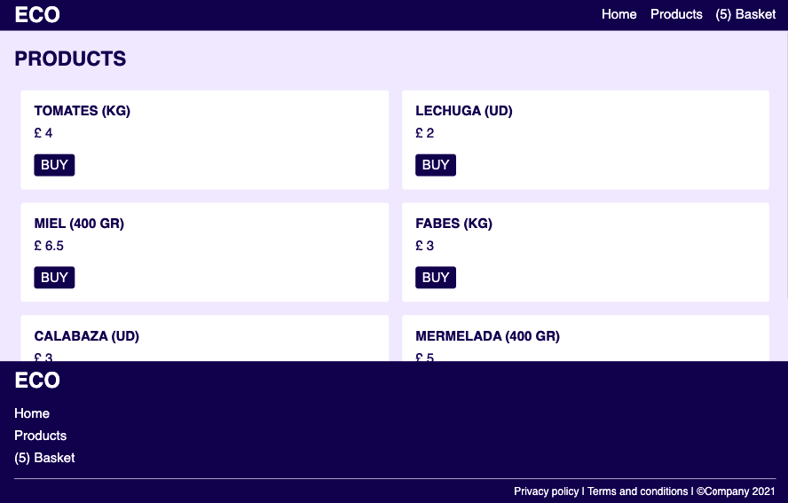
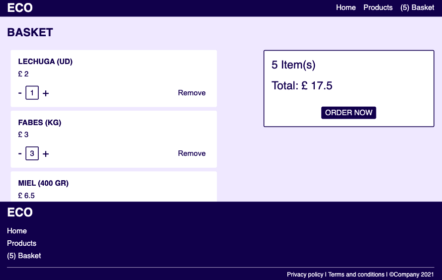

# React E-Commerce Practice

This is a multi-page ecommerce website that has allowed me to put in practice the following React features:

- Reducers: manage all the functionality and state of the components
- Contexts: pass data directly through all the components without passing props every time
- Routing: create different pages in the same website
- Hooks: use state in functional components
- UseEffect: store data in LocalStorage with every state update

### What's In

- Nav:
  - Displays: Links / Basket ItemsCount
- Footer:
  - Displays: Links
- Home:
  - Functionality: Link to Shop
- Products:
  - Displays: list of products (coming from a data file)
  - Functionality: add products to basket
- Basket:
  - Displays: list of items in basket / Checkout Component
  - Functionality: update quantity of basket items / Remove Items / Checkout (clear basket)
- Thank You:
  - Displays: list of purchased items
  - Functionality: Link to Shop

### Project Setup

- Clone repository: `git@github.com:jarasmar/E-Commerce-React.git`
- Jump into folder: `cd E-Commerce-React`
- Start server: `yarn start`
